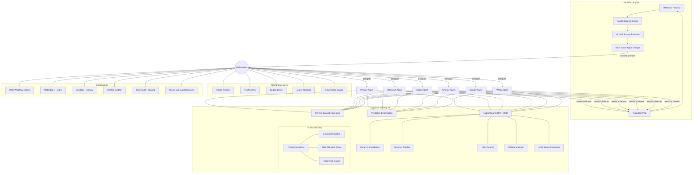

<div align="center">

# Agent Evolution Kit

**Not another LLM wrapper. Agents that learn, reflect, and improve autonomously.**

[](LICENSE)
[](CONTRIBUTING.md)
[](https://github.com/mahsumaktas/agent-evolution-kit/stargazers)

A production-tested framework for multi-agent orchestration where agents genuinely learn from their failures, evolve their own prompts, and govern themselves through academic self-evolution protocols. Built on peer-reviewed papers (Reflexion, MARS, SCOPE, MAR, A-MEM, A-MemGuard, MINJA), cognitive memory v9 with tier hierarchy, emotional memory, hybrid search, dream consolidation, utility scoring, trust-scored read-path hardening, memory quarantine, and hash chain audit trails, plus a governance-first architecture with circuit breakers, budget controls, and native sub-agent gateway. Currently running 11 agents across 28 skills with 40+ infrastructure scripts in daily production.

</div>

---

## Why This Exists

Most multi-agent frameworks are sophisticated LLM wrappers. They let you chain prompts, define roles, and route messages between agents. But when an agent fails a task on Monday, it will fail the exact same way on Tuesday. There is no memory of what went wrong, no reflection on why it failed, and no mechanism to prevent the same mistake. The agent is perpetually a beginner.

The second gap is governance. Production agent systems need the same operational rigor as any distributed service: circuit breakers that trip when an agent degrades, trust scores that gate autonomy levels, maker-checker loops for high-risk actions, and hard budget limits that prevent runaway API costs.

The third gap is memory security. Once agents have long-term memory, that memory becomes an attack surface. Poisoned memories, injected contradictions, and high-frequency writes from compromised agents can degrade the entire system. Without trust scoring, quarantine, and audit trails, memory is a liability rather than an asset.

Agent Evolution Kit closes all three gaps. It implements peer-reviewed self-evolution protocols so agents genuinely improve over time, wraps them in a governance layer designed for production trust requirements, secures long-term memory with trust-gated writes and poisoning defense, and runs everything through a pure orchestrator that never executes tasks itself -- only delegates, monitors, and evolves.

---

## Architecture Overview



The **orchestrator** sits at the center and never executes tasks directly. It routes tasks to specialist agents based on capability matching, monitors execution through governance controls, and feeds results into the evolution engine. Failed tasks trigger reflexion, weekly cycles aggregate patterns into strategic rules and prompt mutations. Cognitive Memory v9 gives each agent long-term retention with tier hierarchy, emotional significance detection, hybrid search, dream consolidation, utility-weighted retrieval, trust-scored write gating, quarantine for suspicious memories, and read-path hardening against poisoning attacks. The Oracle Sub-Agent Gateway provides native Anthropic SDK integration for low-latency inter-agent delegation.

---

## Key Differentiators

| Feature | Agent Evolution Kit | CrewAI | LangGraph | AutoGPT |
|---|:---:|:---:|:---:|:---:|
| Pure orchestrator pattern | Yes | No | No | No |
| Self-evolution from failures | Yes (Reflexion) | No | No | Partial |
| Metacognitive reflection | Yes (MARS) | No | No | No |
| Trajectory learning | Yes (SE-Agent) | No | No | No |
| Cross-agent critique | Yes (MAR) | No | No | No |
| Prompt self-evolution | Yes (SCOPE) | No | No | No |
| Cognitive memory (FSRS-6 + hybrid) | Yes (v9) | No | No | No |
| Dream consolidation | Yes | No | No | No |
| Utility scoring (Bellman) | Yes | No | No | No |
| Intent-based retrieval routing | Yes | No | No | No |
| Relational memory graph | Yes (A-MEM) | No | No | No |
| Memory trust scoring | Yes (A-MemGuard) | No | No | No |
| Memory quarantine system | Yes | No | No | No |
| Hash chain audit trail | Yes (SHA-256) | No | No | No |
| Read-path poisoning defense | Yes (10 patterns) | No | No | No |
| Native sub-agent gateway | Yes (Anthropic SDK) | No | No | No |
| Circuit breakers | Yes | No | No | No |
| Maker-checker governance | Yes | No | No | No |
| Trust score gating | Yes | No | No | No |
| Budget limits per agent | Yes | No | Partial | Partial |
| DAG workflow engine | Yes | No | No | No |
| Sandbox + canary deployment | Yes | No | No | No |
| Record and replay | Yes (AgentRR) | No | Partial | No |
| Swarm patterns (8 templates) | Yes | No | No | No |
| Consensus engine (5 voting types) | Yes | No | No | No |
| Shadow agent monitoring | Yes | No | No | No |
| Operational logging (JSONL) | Yes | No | No | No |
| Production-tested (11 agents) | Yes | Community | Community | Community |

---

## Core Concepts

### Self-Evolution Cycle
The weekly heartbeat. Every cycle: collect trajectories, run reflexion on failures, generate prompt mutations via SCOPE, evaluate with cross-agent critique, and promote the best-performing variants.
[Read more: `docs/self-evolution-playbook.md`](docs/self-evolution-playbook.md)

### Reflexion Protocol
When an agent fails, it generates verbal self-reflection analyzing what went wrong and produces a concrete tactical rule to prevent recurrence. Based on Shinn et al. (2023).
[Read more: `docs/reflexion-protocol.md`](docs/reflexion-protocol.md)

### Trajectory Learning (SE-Agent)
Every task execution is recorded as a trajectory. Four evolution operators -- crossover, mutation, selection, and elitism -- combine successful trajectories to synthesize better strategies.
[Read more: `docs/trajectory-learning.md`](docs/trajectory-learning.md)

### Prompt Evolution (SCOPE)
Dual-stream optimization: a **semantic stream** preserves task-critical instructions while a **structural stream** experiments with formatting, ordering, and emphasis.
[Read more: `docs/prompt-evolution.md`](docs/prompt-evolution.md)

### Cross-Agent Critique (MAR)
No agent reviews its own work in isolation. Multi-Agent Review assigns critique roles to peer agents who evaluate outputs from different domain perspectives.
[Read more: `docs/cross-agent-critique.md`](docs/cross-agent-critique.md)

### Cognitive Memory v9
Long-term memory with tier hierarchy (working, episodic, semantic), emotional significance detection, Hebbian co-activation, hybrid search (vector + FTS + RRF fusion), FSRS-6 power-law decay, prediction error gating, dream consolidation (cluster + LLM merge + theme extraction), Bellman-style utility scoring, relational graphs (A-MEM spreading activation), HyDE query expansion, MMR diversity filtering, observer pipeline, strategic forgetting, and bi-temporal lifecycle.
[Read more: `docs/cognitive-memory.md`](docs/cognitive-memory.md)

### Trust Scoring (A-MemGuard)
Every memory write passes through a trust gate based on the A-MemGuard framework. Each agent has a trust score derived from historical behavior. Writes from agents with trust below 0.3 are rejected outright. Scores between 0.3 and 0.5 route the memory to quarantine for human review. Only agents above 0.5 write directly to long-term storage. Anomaly detection flags burst writes and suspiciously high-importance claims, automatically downgrading trust when patterns match known poisoning vectors.
[Read more: `docs/cognitive-memory.md`](docs/cognitive-memory.md)

### Memory Quarantine
Memories flagged by trust scoring or disputed by other agents enter quarantine -- a holding area where they cannot influence retrieval results. The `ltm quarantine` CLI provides list, review, release, and delete operations. When three or more agents dispute a memory via `disputeMemory()`, it is auto-quarantined regardless of the writing agent's trust score. This prevents a single compromised agent from corrupting the shared knowledge base.
[Read more: `docs/cognitive-memory.md`](docs/cognitive-memory.md)

### Read-Path Hardening
Defense against memory poisoning does not stop at write-time. The read path applies trust-aware re-ranking so low-trust memories rank lower even if semantically relevant. Ten poisoning indicator patterns (prompt injection markers, unusual encoding, contradictions with established facts) are checked at retrieval time. Contradiction detection cross-references retrieved memories against each other. Query rate anomaly tracking detects and throttles suspicious retrieval patterns that may indicate extraction attacks. Based on MINJA and OWASP ASI06 guidelines.
[Read more: `docs/cognitive-memory.md`](docs/cognitive-memory.md)

### Oracle Sub-Agent Gateway
Native sub-agent execution using Anthropic SDK `toolRunner` for low-latency inter-agent delegation (1--3s per call vs 12s via CLI). Three tools: `oracle_agent` (unified gateway), `oracle_research` (deep research with web access), and `oracle_code` (coding tasks). Four modes select the appropriate model and tool set: research (Opus, 50 turns), code (Sonnet, 30 turns), analyze (Opus, 20 turns), and quick (Haiku, 3 turns). Internal tools include file operations, search, bash, and memory store/recall. Prompt caching with `cache_control: ephemeral` provides 90% read cost discount on system prompts.

### Dream Consolidation
Periodic 8-step memory lifecycle: utility decay, rehearsal, foresight expiry, strategic forgetting, clustering, LLM consolidation (max 5 calls), redundancy detection, and deep abstraction. Keeps memory lean while preserving valuable patterns.
[Read more: `docs/cognitive-memory.md#dream-consolidation`](docs/cognitive-memory.md)

### Utility Scoring
Bellman-style tracking of memory usefulness. Updates on use (learning rate 0.1), decays toward neutral prior (0.01/day), and weights retrieval scoring (60% semantic, 20% utility, 20% importance).
[Read more: `docs/cognitive-memory.md#bellman-style-utility-scoring`](docs/cognitive-memory.md)

### Intent-Based Routing
Classifies query intent (factual, temporal, causal, entity, preference, general) and selects optimal retrieval strategy -- including graph traversal for causal queries and entity hub lookup for profile queries.
[Read more: `docs/cognitive-memory.md#intent-based-retrieval-routing`](docs/cognitive-memory.md)

### Strategic Forgetting
Capacity-aware pruning: contradiction cleanup, foresight expiry, utility floor (< 0.15 + 30 days unused), redundancy detection (cosine > 0.9), and capacity management (500 active limit). Dormant memories move to cold storage, never deleted.
[Read more: `docs/cognitive-memory.md#strategic-forgetting`](docs/cognitive-memory.md)

### Audit Trail
SHA-256 hash chain verification for all memory operations. Each write appends to an immutable audit log where every entry's hash incorporates the previous entry's hash, forming a tamper-evident chain. The `ltm audit` CLI provides verify (chain integrity check), log (recent operations), and stats (per-agent write/read statistics) commands. This enables forensic analysis when memory corruption is suspected.
[Read more: `docs/cognitive-memory.md`](docs/cognitive-memory.md)

### Operational Logging
Fire-and-forget JSONL telemetry for all LLM-assisted decisions. 10MB rotation, async append, zero latency impact. Enables post-hoc analysis of memory operations.
[Read more: `docs/cognitive-memory.md#operational-logging`](docs/cognitive-memory.md)

### Circuit Breaker
When an agent's failure rate exceeds a threshold, the circuit breaker trips and routes tasks to fallback agents. After cooldown, the agent is gradually reintroduced.
[Read more: `docs/circuit-breaker.md`](docs/circuit-breaker.md)

### Maker-Checker Loop
High-risk actions require a second agent to verify before execution. The checker is selected based on domain expertise and cannot be the proposing agent.
[Read more: `docs/maker-checker.md`](docs/maker-checker.md)

### Governance Engine
Policy enforcement, compliance checks, approval workflows, and audit trails. Configurable via YAML rule definitions.
[Read more: `docs/architecture.md`](docs/architecture.md)

### DAG Workflow Engine
Directed Acyclic Graph workflow execution with parallel steps, dependencies, retry logic, and timeout handling.
[Read more: `scripts/README.md`](scripts/README.md)

### Sandbox + Canary Deployment
3-layer validation pipeline (L1 quick load test, L2 type checking, L3 canary deployment) with 60-second canary monitoring and auto-rollback.
[Read more: `scripts/README.md`](scripts/README.md)

---

## Quick Start

### Track 1: Claude Code Users

```bash
git clone https://github.com/mahsumaktas/agent-evolution-kit.git
cd agent-evolution-kit

# Copy skills into your Claude Code skills directory
cp -r skills/ ~/.claude/skills/

# Copy orchestration template into your project
cp templates/orchestration.md YOUR_PROJECT/ORCHESTRATION.md

# Set up infrastructure scripts
export AGENT_HOME="$HOME/.agent-evolution"
./scripts/metrics.sh init
./scripts/system-check.sh --full
```

Then add to your project's `CLAUDE.md`:

```markdown
## Agent Evolution
- Follow ORCHESTRATION.md for all task routing
- After any failed task, run the Reflexion Protocol (docs/reflexion-protocol.md)
- Weekly: run the self-evolution cycle (docs/self-evolution-playbook.md)
- Store trajectories in memory/trajectory-pool.json
- Store reflections in memory/reflections/{agent-name}/
```

### Track 2: Other Frameworks

The evolution protocols are framework-agnostic:

```bash
git clone https://github.com/mahsumaktas/agent-evolution-kit.git
cd agent-evolution-kit

# Start with the architecture overview
cat docs/architecture.md

# Implement reflexion in your framework
cat docs/reflexion-protocol.md

# Set up trajectory storage
cat docs/trajectory-learning.md

# Add governance controls
cat config/governance.example.yaml
```

### Track 3: Just the Evolution System

```bash
git clone https://github.com/mahsumaktas/agent-evolution-kit.git
cd agent-evolution-kit

# Core files:
# - docs/reflexion-protocol.md      (failure reflection)
# - docs/prompt-evolution.md        (SCOPE dual-stream)
# - docs/trajectory-learning.md     (experience storage)
# - docs/self-evolution-playbook.md (weekly cycle)
# - scripts/weekly-cycle.sh         (automation runner)
```

Minimum integration: (1) call reflexion after failures, (2) maintain trajectory pool, (3) run weekly evolution cycle.

---

## Academic Foundations

| Paper | Year | Key Idea | Implementation |
|---|---|---|---|
| **Reflexion** | 2023 | Verbal reinforcement learning from failures | [`docs/reflexion-protocol.md`](docs/reflexion-protocol.md) |
| **MAR** | 2024 | Multi-agent cross-review catches single-agent blind spots | [`docs/cross-agent-critique.md`](docs/cross-agent-critique.md) |
| **A-MEM** | 2024 | Spreading activation for memory evolution and crosslinking | [`docs/cognitive-memory.md`](docs/cognitive-memory.md) |
| **SCOPE** | 2024 | Dual-stream prompt optimization (semantic + structural) | [`docs/prompt-evolution.md`](docs/prompt-evolution.md) |
| **MINJA** | 2024 | Memory injection attack defense and detection patterns | [`docs/cognitive-memory.md`](docs/cognitive-memory.md) |
| **SE-Agent** | 2025 | Evolutionary operators on experience trajectories | [`docs/trajectory-learning.md`](docs/trajectory-learning.md) |
| **MARS** | 2025 | Two-level metacognitive reflection catches systematic bias | [`docs/metacognitive-reflection.md`](docs/metacognitive-reflection.md) |
| **AgentRR** | 2025 | Two-level experience storage for debugging and learning | [`docs/record-and-replay.md`](docs/record-and-replay.md) |
| **A-MemGuard** | 2025 | Consensus + dual-memory trust framework for memory security | [`docs/cognitive-memory.md`](docs/cognitive-memory.md) |
| **HyDE** (Gao et al.) | 2022 | Hypothetical document embeddings for query expansion | [`docs/cognitive-memory.md`](docs/cognitive-memory.md) |
| **MMR** (Carbonell) | 1998 | Maximal marginal relevance for diverse retrieval | [`docs/cognitive-memory.md`](docs/cognitive-memory.md) |
| **RRF** (Cormack) | 2009 | Reciprocal rank fusion for hybrid search | [`docs/cognitive-memory.md`](docs/cognitive-memory.md) |
| **ACT-R** (Anderson) | 1993 | Base-level activation model from cognitive psychology | [`docs/cognitive-memory.md`](docs/cognitive-memory.md) |
| **OWASP ASI06** | 2025 | Memory poisoning prevention guidelines for AI agents | [`docs/cognitive-memory.md`](docs/cognitive-memory.md) |

ArXiv: [2303.11366](https://arxiv.org/abs/2303.11366), [2512.20845](https://arxiv.org/abs/2512.20845), [2512.15374](https://arxiv.org/abs/2512.15374), [2508.02085](https://arxiv.org/abs/2508.02085), [2601.11974](https://arxiv.org/abs/2601.11974), [2505.17716](https://arxiv.org/abs/2505.17716)

---

## The Brain: Where We Are and Where We're Going

### Current State (After Phase 0--4 + Phase 7)

Each agent has a strong individual memory. It remembers what matters, forgets what doesn't, organizes knowledge into tiers (working, episodic, semantic), runs dream consolidation cycles to merge and compress, detects emotional significance, and strengthens associative links through Hebbian co-activation.

Phase 7 added a security and governance layer to that memory. Every write passes through trust scoring -- agents earn or lose trust based on behavioral patterns, and low-trust writes are rejected or quarantined. A SHA-256 hash chain audit trail makes all memory operations tamper-evident. The read path defends against poisoning with 10 detection patterns, contradiction checking, and trust-aware re-ranking. A dispute mechanism lets agents flag suspicious memories, with auto-quarantine after three disputes.

But every agent is still an island. CikCik learns something valuable -- no other agent knows. Soros makes a strategic decision -- it never reaches the orchestrator. Eleven agents, eleven isolated brains with individually hardened memory.

### The Full Vision (After Phase 5--11)

| Capability | Now (Phase 0--4 + 7) | After (Phase 5--11) |
|---|---|---|
| **Cross-agent knowledge** | Zero. Every agent is isolated. | Federation -- what CikCik learns, the orchestrator knows too |
| **Security & governance** | Trust scoring, quarantine, hash chain audit, read-path hardening | Full RBAC -- role-based access per agent, per memory tier |
| **Resilience** | Gateway crash = everything stops | Self-healing -- watchdog, retry, graceful degradation |
| **Skill learning** | Static -- agents use what you give them | Skill Memory -- agents learn from doing, mine patterns from workflows |
| **Research quality** | HyDE + embedding cache | HippoRAG + AMA-Bench -- academic-grade recall and evaluation |
| **Memory compression** | Dream consolidation (cluster + merge) | SimpleMem semantic compression + hippocampal replay priority queue |
| **Future awareness** | Basic foresight (time-bounded memories) | Prospective memory -- agents remember future intentions |

**In one sentence:** Right now, each agent has a good brain with security guardrails. When the plan is complete, those brains will be connected -- eleven agents sharing knowledge through a federated, self-improving network.

### Phase Roadmap

```
Phase 0-4   [COMPLETE] ████████████████████░░░░░░░░░░░░░░░░ Individual Intelligence
Phase 7     [COMPLETE] ████████████████████░░░░░░░░░░░░░░░░ Memory Security & Hardening
Phase 5     [NEXT]     ░░░░░░░░░░░░░░░░░░░░░░░░░░░░░░░░░░░ Cross-Agent Federation
Phase 6                ░░░░░░░░░░░░░░░░░░░░░░░░░░░░░░░░░░░ Advanced Governance
Phase 8                ░░░░░░░░░░░░░░░░░░░░░░░░░░░░░░░░░░░ Infrastructure & UX
Phase 9                ░░░░░░░░░░░░░░░░░░░░░░░░░░░░░░░░░░░ Skill Learning
Phase 10-11            ░░░░░░░░░░░░░░░░░░░░░░░░░░░░░░░░░░░ Research Extensions
```

**Phase 0--4** built the individual brain. **Phase 7** secured it. **Phase 5--11** builds the collective mind.

---

## Repository Structure

```
agent-evolution-kit/
├── README.md
├── LICENSE
├── CONTRIBUTING.md
│
├── config/
│   ├── governance.example.yaml
│   ├── routing-profiles.example.yaml
│   ├── autonomy-levels.example.yaml
│   ├── maker-checker-pairs.example.yaml
│   ├── priority-rules.example.yaml
│   ├── restart-policies.example.yaml
│   ├── shadow-agents.example.yaml
│   └── swarm-patterns/                  # 8 orchestration pattern configs
│       ├── circuit-breaker.yaml
│       ├── consensus.yaml
│       ├── escalation.yaml
│       ├── fan-out.yaml
│       ├── pipeline.yaml
│       ├── red-team.yaml
│       ├── reflection.yaml
│       └── review-loop.yaml
│
├── docs/                                # 31 documentation files
│   ├── architecture.md                  # System architecture
│   ├── cognitive-memory.md              # Memory v9 (tiers, trust, quarantine, audit)
│   ├── orchestration-v4.md              # Latest orchestration patterns
│   ├── memory-system.md                 # Memory architecture overview
│   ├── model-architecture.md            # Multi-model strategy
│   ├── api-routing-architecture.md      # API/model routing
│   ├── health-system.md                 # System health monitoring
│   ├── cron-catalog.md                  # Automated task catalog
│   ├── learnings.md                     # Production lessons learned
│   ├── distiller-surveyor-design.md     # Advanced design patterns
│   ├── browser-automation-rules.md      # Browser automation guide
│   ├── security-rules.md               # Security guidelines
│   ├── self-evolution-playbook.md       # Weekly evolution cycle
│   ├── reflexion-protocol.md            # Reflexion implementation
│   ├── trajectory-learning.md           # SE-Agent operators
│   ├── prompt-evolution.md              # SCOPE optimization
│   ├── cross-agent-critique.md          # MAR review protocol
│   ├── metacognitive-reflection.md      # MARS dual reflection
│   ├── record-and-replay.md            # AgentRR experience management
│   ├── hybrid-evaluation.md            # Combined evaluation
│   ├── circuit-breaker.md              # Failure detection
│   ├── maker-checker.md                # Dual approval
│   ├── capability-routing.md           # Task-agent matching
│   ├── autonomy-layers.md              # 5-level autonomy
│   ├── swarm-patterns.md               # Orchestration templates
│   ├── consensus-engine.md             # Voting engine
│   ├── shadow-agent.md                 # Observer monitoring
│   ├── priority-queue.md               # Task prioritization
│   ├── context-compaction.md           # Memory compaction
│   ├── quick-start.md                  # Getting started guide
│   └── academic-references.md          # Paper summaries
│
├── skills/                              # 28 operational skills
│   ├── README.md                        # Full skill catalog
│   ├── tdd-workflow/                    # Test-driven development
│   ├── systematic-debugging/            # 4-phase debugging
│   ├── verification-gate/               # Evidence-based verification
│   ├── structured-brainstorming/        # Design-first workflow
│   ├── subagent-execution/              # Subagent delegation
│   ├── orchestrator-loop/               # Orchestrator pipeline
│   ├── agent-browser/                   # Browser automation
│   ├── agent-governance/                # Governance enforcement
│   ├── agent-learning-loop/             # Learn from failures
│   ├── agent-live-quality-ops/          # Quality monitoring
│   ├── agent-memory-proactivity-ops/    # Proactive memory
│   ├── agent-output-hygiene-ops/        # Output quality
│   ├── agent-stability-ops/             # System stability
│   ├── auto-updater/                    # Self-update capability
│   ├── deep-research/                   # Multi-source research
│   ├── domaindetails/                   # Domain analysis
│   ├── hn/                              # Hacker News monitoring
│   ├── humanizer/                       # Natural language output
│   ├── memory-hygiene/                  # Memory maintenance
│   ├── model-usage/                     # LLM model selection
│   ├── nano-pdf/                        # PDF processing
│   ├── news-aggregator-skill/           # News aggregation
│   ├── prompt-guard/                    # Injection defense
│   ├── security-review/                 # Security audit
│   ├── self-improving-agent/            # Self-improvement cycle
│   ├── summarize/                       # Content summarization
│   ├── tavily-search/                   # Web search
│   └── topic-monitor/                   # Topic tracking
│
├── scripts/                             # 40 infrastructure scripts
│   ├── README.md                        # Full script catalog
│   ├── bridge.sh                        # LLM CLI wrapper
│   ├── watchdog.sh                      # Self-healing monitor
│   ├── metrics.sh                       # SQLite metrics
│   ├── briefing.sh                      # Daily status reports
│   ├── goal-decompose.sh               # Goal tree management
│   ├── dag.sh                           # DAG workflow engine
│   ├── governance.sh                    # Policy enforcement
│   ├── sandbox.sh                       # 3-layer validation
│   ├── canary-deploy.sh                # Canary deployment
│   ├── agent-factory.sh                # Agent creation
│   ├── agent-health.sh                 # Agent health monitoring
│   ├── blackboard.sh                   # Inter-agent communication
│   ├── consciousness.sh                # Agent state tracking
│   ├── cron-audit.sh                   # Cron job audit
│   ├── cron-watchdog.sh                # Cron monitoring
│   ├── cron-self-healer.sh             # Auto-repair crons
│   ├── event-bridge.sh                 # Event routing
│   ├── evolve-prompt.sh                # Prompt evolution
│   ├── iterative-research.sh           # Deep research
│   ├── memory-index.sh                 # Memory indexing
│   ├── memory-isolation-test.sh         # Cross-agent memory test
│   ├── parallel-browser.sh             # Multi-tab browser
│   ├── tool-gen.sh                     # Tool generation
│   ├── captcha-solver.sh               # Captcha solving
│   └── ... (40 total)
│
├── workflows/                           # DAG workflow definitions
│   ├── morning-routine.json
│   ├── weekly-evolution.json
│   └── deploy-pipeline.json
│
├── templates/
│   ├── identity.md                      # Orchestrator identity
│   ├── agent-profile.md                 # Agent profile template
│   ├── claude-md.md                     # CLAUDE.md integration
│   └── orchestration.md                 # Orchestration config
│
├── examples/
│   ├── claude-code-setup/               # Claude Code integration
│   └── minimal-evolution/               # Minimal reflexion setup
│
└── memory/
    ├── README.md
    ├── schemas/                          # JSON schemas
    └── examples/                         # Example data
```

---

## Contributing

Contributions are welcome. Please read [`CONTRIBUTING.md`](CONTRIBUTING.md) before submitting a pull request.

Areas where contributions are especially valuable:
- **Additional evolution operators** for trajectory learning
- **Framework adapters** for LangChain, CrewAI, LangGraph, or other orchestration frameworks
- **Evaluation benchmarks** for measuring evolution effectiveness
- **Cognitive memory backends** beyond the reference LanceDB implementation
- **Memory security patterns** -- trust scoring strategies, poisoning detection rules, quarantine policies
- **Production case studies** from teams running the evolution system
- **New skills** following the SKILL.md format

---

## License

MIT License. See [`LICENSE`](LICENSE) for details.

---

<div align="center">

**Agent Evolution Kit** is built on the belief that agents should get better at their jobs over time, just like the humans who build them.

[Report a Bug](https://github.com/mahsumaktas/agent-evolution-kit/issues) -- [Request a Feature](https://github.com/mahsumaktas/agent-evolution-kit/issues) -- [Read the Docs](docs/)

</div>
