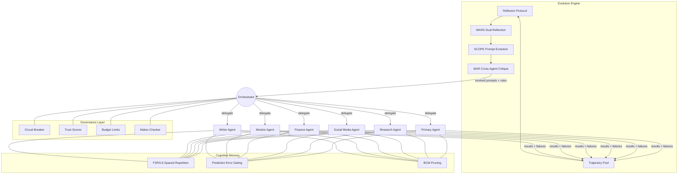

<div align="center">

# Agent Evolution Kit

**Not another LLM wrapper. Agents that learn, reflect, and improve autonomously.**

[](LICENSE)
[](CONTRIBUTING.md)
[](https://github.com/mahsumaktas/agent-evolution-kit/stargazers)

A production-tested framework for multi-agent orchestration where agents genuinely learn from their failures, evolve their own prompts, and govern themselves through academic self-evolution protocols. Built on four peer-reviewed papers (Reflexion, MARS, SCOPE, MAR), cognitive memory with spaced repetition, and a governance-first architecture with trust scores, circuit breakers, and budget controls. Currently running 11 agents and 43 skills in daily production.

</div>

---

## Why This Exists

Most multi-agent frameworks are sophisticated LLM wrappers. They let you chain prompts, define roles, and route messages between agents. But when an agent fails a task on Monday, it will fail the exact same way on Tuesday. There is no memory of what went wrong, no reflection on why it failed, and no mechanism to prevent the same mistake. The agent is perpetually a beginner, regardless of how many tasks it has completed.

The second gap is governance. Production agent systems need the same operational rigor as any distributed service: circuit breakers that trip when an agent degrades, trust scores that gate autonomy levels, maker-checker loops for high-risk actions, and hard budget limits that prevent a runaway agent from burning through API credits. Most frameworks treat these as afterthoughts, if they address them at all.

Agent Evolution Kit closes both gaps. It implements four peer-reviewed self-evolution protocols so agents genuinely improve over time, wraps them in a governance layer designed for production trust requirements, and runs everything through a pure orchestrator that never executes tasks itself -- only delegates, monitors, and evolves. This is not a research prototype. It runs 11 agents across 43 skills in daily production, handling tasks from social media scheduling to financial analysis to security monitoring. The evolution system has been running weekly cycles since early 2026, with measurable improvements in agent success rates tracked through trajectory pools and metrics databases.

---

## Architecture Overview



The **orchestrator** sits at the center and never executes tasks directly. It routes tasks to specialist agents based on capability matching, monitors their execution through governance controls, and feeds results into the evolution engine. Failed tasks trigger reflexion, which produces tactical rules. Weekly evolution cycles aggregate patterns into strategic rules and prompt mutations. Cross-agent critique ensures no single agent's perspective dominates the learning process. Cognitive memory gives each agent long-term retention with biologically-inspired forgetting curves.

---

## Key Differentiators

| Feature | Agent Evolution Kit | CrewAI | LangGraph | AutoGPT |
|---|:---:|:---:|:---:|:---:|
| Pure orchestrator pattern | Yes | No | No | No |
| Self-evolution from failures | Yes (Reflexion) | No | No | Partial |
| Metacognitive reflection | Yes (MARS) | No | No | No |
| Trajectory learning | Yes (SE-Agent) | No | No | No |
| Cross-agent critique | Yes (MAR) | No | No | No |
| Prompt self-evolution | Yes (SCOPE) | No | No | No |
| Cognitive memory (FSRS-6) | Yes | No | No | No |
| Circuit breakers | Yes | No | No | No |
| Maker-checker governance | Yes | No | No | No |
| Trust score gating | Yes | No | No | No |
| Budget limits per agent | Yes | No | Partial | Partial |
| Record and replay | Yes (AgentRR) | No | Partial | No |
| Production-tested (11+ agents) | Yes | Community | Community | Community |
| Swarm Patterns (24 orchestration templates) | Yes | No | No | No |
| Consensus Engine (5 voting types) | Yes | No | No | No |
| Shadow Agent (observer monitoring) | Yes | No | No | No |
| Context Compaction (5-stage memory cleanup) | Yes | No | No | No |

No existing framework combines all four: **self-evolution**, **cognitive memory**, **pure orchestration**, and **governance-first design**.

---

## Core Concepts

### Self-Evolution Cycle
The weekly heartbeat of the system. Every cycle: collect trajectories, run reflexion on failures, generate prompt mutations via SCOPE, evaluate with cross-agent critique, and promote the best-performing variants. This is how agents get measurably better over time without human intervention.
[Read more: `docs/self-evolution-playbook.md`](docs/self-evolution-playbook.md)

### Reflexion Protocol
When an agent fails, it generates a verbal self-reflection analyzing what went wrong and produces a concrete tactical rule to prevent recurrence. Based on Shinn et al. (2023), extended with persistent rule storage and conflict detection across agents.
[Read more: `docs/reflexion-protocol.md`](docs/reflexion-protocol.md)

### Trajectory Learning (SE-Agent)
Every task execution is recorded as a trajectory with inputs, outputs, intermediate steps, and outcome. Four evolution operators -- crossover, mutation, selection, and elitism -- combine successful trajectories to synthesize better strategies over time.
[Read more: `docs/trajectory-learning.md`](docs/trajectory-learning.md)

### Prompt Evolution (SCOPE)
Dual-stream prompt optimization: a **semantic stream** preserves task-critical instructions while a **structural stream** experiments with formatting, ordering, and emphasis. Mutations are evaluated against a held-out test set before promotion to production.
[Read more: `docs/prompt-evolution.md`](docs/prompt-evolution.md)

### Cross-Agent Critique (MAR)
No agent reviews its own work in isolation. The Multi-Agent Review protocol assigns critique roles to peer agents who evaluate outputs from different domain perspectives. This prevents blind spots and echo-chamber effects in the evolution process.
[Read more: `docs/cross-agent-critique.md`](docs/cross-agent-critique.md)

### Metacognitive Reflection (MARS)
Dual-level reflection where agents evaluate not just task outcomes but their own reasoning process. The first level reflects on "what went wrong," the second level reflects on "why my reflection might be biased." This catches systematic reasoning failures that single-level reflexion misses.
[Read more: `docs/metacognitive-reflection.md`](docs/metacognitive-reflection.md)

### Record and Replay (AgentRR)
Two-level experience storage: fine-grained action logs for debugging and coarse-grained strategy summaries for learning. Failed trajectories are replayed with modified parameters to identify the minimum change needed for success.
[Read more: `docs/record-and-replay.md`](docs/record-and-replay.md)

### Hybrid Evaluation
Combines automated metrics (task completion, latency, cost) with LLM-as-judge evaluation and optional human review. Evaluation results feed directly into the evolution cycle to guide prompt selection and agent trust scores.
[Read more: `docs/hybrid-evaluation.md`](docs/hybrid-evaluation.md)

### Circuit Breaker
Borrowed from distributed systems: when an agent's failure rate exceeds a threshold within a time window, the circuit breaker trips and routes tasks to fallback agents. After a cooldown period, the agent is gradually reintroduced with reduced load.
[Read more: `docs/circuit-breaker.md`](docs/circuit-breaker.md)

### Maker-Checker Loop
High-risk actions (deployments, financial transactions, external communications) require a second agent to verify before execution. The checker agent is selected based on domain expertise and cannot be the same agent that proposed the action.
[Read more: `docs/maker-checker.md`](docs/maker-checker.md)

### Cognitive Memory (FSRS-6)
Long-term memory with biologically-inspired retention. FSRS-6 power-law decay replaces naive TTL expiration. Prediction Error gating decides whether new information should create, update, reinforce, or supersede existing memories. BCM floating-threshold pruning prevents unbounded memory growth.
[Read more: `docs/cognitive-memory.md`](docs/cognitive-memory.md)

### Capability-Based Routing
Tasks are matched to agents based on declared capabilities, historical success rates, current load, and cost efficiency. The routing algorithm is a weighted score, not a simple keyword match, and adapts as agents evolve new competencies.
[Read more: `docs/capability-routing.md`](docs/capability-routing.md)

### Autonomy Layers
Five graduated levels of agent autonomy, from fully supervised (every action requires approval) to fully autonomous (agent operates independently within governance constraints). Trust scores determine an agent's current autonomy level, and the level can be raised or lowered dynamically.
[Read more: `docs/autonomy-layers.md`](docs/autonomy-layers.md)

### Pure Orchestrator Pattern
The orchestrator never writes code, never calls external APIs directly, and never produces end-user outputs. It only decomposes tasks, delegates to specialist agents, monitors progress, and manages the evolution lifecycle. This separation of concerns prevents the orchestrator from becoming a bottleneck or single point of failure.
[Read more: `docs/architecture.md`](docs/architecture.md)

### Swarm Patterns
24 multi-agent orchestration templates covering coordination topologies from simple pipelines to adversarial red-team exercises. Eight patterns are fully implemented with YAML configs and runner support; sixteen additional patterns are documented and ready for implementation.
[Read more: `docs/swarm-patterns.md`](docs/swarm-patterns.md)

### Consensus Engine
Five voting types (majority, supermajority, unanimous, weighted, quorum) for multi-agent collective decisions. Supports early termination, tie-breaking strategies, and integration with swarm patterns and cross-agent critique.
[Read more: `docs/consensus-engine.md`](docs/consensus-engine.md)

### Shadow Agent
Observer pattern for automated agent monitoring. A shadow agent watches other agents work in one of three modes (passive, review, active) and flags issues based on configurable triggers, with built-in cost controls to keep evaluation cheap.
[Read more: `docs/shadow-agent.md`](docs/shadow-agent.md)

### Priority Queue
P0-P4 task prioritization with keyword-based auto-assignment and queue drop policies. Critical tasks are never dropped; low-priority tasks are shed under load. Integrates with goal decomposition and the bridge for priority-aware task routing.
[Read more: `docs/priority-queue.md`](docs/priority-queue.md)

### Context Compaction
5-stage automated memory cleanup: trajectory archival, bridge log rotation, reflection deduplication via Jaccard similarity, importance-scored knowledge demotion, and dated directory archival. Keeps memory lean without losing important information. Runs as part of the weekly evolution cycle or on-demand.
[Read more: `docs/context-compaction.md`](docs/context-compaction.md)

### Hybrid Evaluation
Two-layer quality gate: Layer 1 runs zero-cost heuristic checks on every output (8 standard checks plus custom per-agent checks). Layer 2 invokes a cheap LLM evaluation only for flagged or high-importance outputs. Keeps evaluation costs near zero for routine work.
[Read more: `docs/hybrid-evaluation.md`](docs/hybrid-evaluation.md)

### Autonomy Levels
Five-level progressive autonomy model from fully supervised (Layer 1) to fully autonomous (Layer 5). Each layer adds capabilities while maintaining safety constraints. Trust scores gate advancement, and any layer can be rolled back.
[Read more: `docs/autonomy-layers.md`](docs/autonomy-layers.md)

### Governance Framework
The overarching system that ties trust scores, circuit breakers, budget limits, maker-checker loops, and audit logging into a coherent operational model. Every agent action is logged, every resource consumption is tracked, and every high-risk operation goes through a defined approval flow.
[Architecture: `docs/architecture.md`](docs/architecture.md) | [Config: `config/governance.example.yaml`](config/governance.example.yaml)

---

## Quick Start

### Track 1: Claude Code Users

If you are using [Claude Code](https://docs.anthropic.com/en/docs/claude-code), the fastest path:

```bash
# Clone the repo
git clone https://github.com/mahsumaktas/agent-evolution-kit.git
cd agent-evolution-kit

# Copy the skill definitions into your Claude Code skills directory
cp -r skills/ ~/.claude/skills/

# Copy the orchestration template into your project
cp templates/orchestration.md YOUR_PROJECT/ORCHESTRATION.md

# Customize agent definitions for your use case
# Use templates/agent-profile.md as a starting point for each agent
```

Then add to your project's `CLAUDE.md`:

```markdown
## Agent Evolution
- Follow ORCHESTRATION.md for all task routing
- After any failed task, run the Reflexion Protocol (docs/reflexion-protocol.md)
- Weekly: run the self-evolution cycle (docs/self-evolution-playbook.md)
- Store trajectories in memory/trajectory-pool.json
- Store reflections in memory/reflections/{agent-name}/
```

### Track 2: Other Frameworks

The evolution protocols are framework-agnostic. Adapt the documentation to your stack:

```bash
git clone https://github.com/mahsumaktas/agent-evolution-kit.git
cd agent-evolution-kit

# Read the architecture overview
cat docs/architecture.md

# Implement the reflexion protocol in your framework
# See docs/reflexion-protocol.md for the full specification

# Set up trajectory storage
# See docs/trajectory-learning.md for schema and operators

# Add governance controls
# See config/governance.example.yaml for circuit breaker and trust score specs
```

### Track 3: Just the Evolution System

If you only want self-evolution without the full orchestration framework:

```bash
git clone https://github.com/mahsumaktas/agent-evolution-kit.git
cd agent-evolution-kit

# Core evolution files you need:
# - docs/reflexion-protocol.md          (failure reflection)
# - docs/prompt-evolution.md            (SCOPE dual-stream optimization)
# - docs/trajectory-learning.md         (experience storage and operators)
# - docs/self-evolution-playbook.md     (weekly cycle specification)
# - memory/schemas/trajectory-pool.schema.json  (trajectory data schema)
# - scripts/weekly-cycle.sh             (automated weekly cycle runner)
```

Minimum integration requires:
1. After each failed task, call your LLM with the reflexion template and store the output
2. Maintain a trajectory pool (JSON file) of task outcomes
3. Run the evolution cycle weekly to aggregate learnings into prompt improvements

---

## Watch an Agent Learn

A concrete example of the evolution loop in action:

```
Day 1, 02:30 AM
  Task: Fetch CVE data from NVD API for vulnerability report
  Result: FAILURE -- HTTP 429 (rate limited)

  Reflexion triggers automatically:
    Analysis: "NVD API enforces strict rate limits during off-peak hours
               when batch jobs from other consumers saturate the endpoint.
               The 02:30 AM window coincides with peak batch processing."
    Tactical rule generated:
      IF target_api == "NVD" AND error == 429
      THEN wait(30min) AND retry with backoff
      ALSO prefer daytime window (09:00-17:00 UTC) for NVD requests

  Rule stored in: memory/reflections/monitor-agent/2026-02-15.md
  Trajectory stored in: memory/trajectory-pool.json (status: FAILURE)

Day 2, 10:15 AM
  Task: Fetch CVE data from NVD API (same task, rescheduled)

  Agent checks tactical rules before execution:
    Match found: "prefer daytime window for NVD requests"
    Action: proceed (current time is within preferred window)

  Result: SUCCESS -- 247 CVEs retrieved in 3.2 seconds
  Trajectory stored: status: SUCCESS, strategy: "daytime-api-call"

Week 2, Sunday 22:00 -- Weekly Evolution Cycle
  Trajectory analysis across all agents:
    Pattern detected: 3/5 external API failures occurred between 01:00-04:00

  Strategic rule promoted (applies to ALL agents):
    "For external API calls with rate limits, prefer 08:00-18:00 UTC.
     If off-hours execution is required, implement exponential backoff
     starting at 30 seconds."

  SCOPE prompt evolution:
    Monitor agent system prompt mutated:
      + "When planning API calls, check rate limit history and prefer
         daytime windows for rate-limited endpoints."
    Mutation evaluated against 10 held-out test cases: 9/10 pass
    Mutation promoted to production.

Week 4 -- Cross-Agent Critique (MAR)
  Finance agent reviews monitor agent's API strategy:
    Critique: "Daytime preference is sound for US/EU APIs, but Asian
              financial APIs (TSE, HKEX) have inverted peak hours.
              Rule should be timezone-aware."

  Rule refined:
    "For external APIs, check endpoint timezone and prefer that
     timezone's business hours for rate-limited requests."
```

This entire loop -- failure, reflection, rule generation, validation, cross-agent review, and rule refinement -- happens without human intervention.

---

## Academic Foundations

Every evolution mechanism in this framework is grounded in peer-reviewed research:

| Paper | Year | Key Idea | Implementation |
|---|---|---|---|
| **Reflexion**: Language Agents with Verbal Reinforcement Learning | 2023 | Agents reflect on failures in natural language and use reflections as memory for future attempts | [`docs/reflexion-protocol.md`](docs/reflexion-protocol.md) |
| **MAR**: Multi-Agent Review for Multi-Step Reasoning | 2024 | Multiple agents critique each other's outputs to catch errors no single agent would find | [`docs/cross-agent-critique.md`](docs/cross-agent-critique.md) |
| **SCOPE**: Dual-Stream Prompt Optimization | 2024 | Separating semantic content from structural formatting in prompt evolution yields better optimization | [`docs/prompt-evolution.md`](docs/prompt-evolution.md) |
| **SE-Agent**: Self-Evolving Agents with Trajectory Evolution | 2025 | Evolutionary operators (crossover, mutation, selection) applied to agent experience trajectories | [`docs/trajectory-learning.md`](docs/trajectory-learning.md) |
| **MARS**: Metacognitive Agents with Reflective Self-awareness | 2025 | Two-level reflection catches systematic biases that single-level reflexion misses | [`docs/metacognitive-reflection.md`](docs/metacognitive-reflection.md) |
| **AgentRR**: Agent Record and Replay for Experience Management | 2025 | Two-level experience storage (fine-grained logs + coarse-grained summaries) enables both debugging and learning | [`docs/record-and-replay.md`](docs/record-and-replay.md) |
| **SimpleMem**: Memory-Augmented LLM Agents | 2025 | Structured long-term memory with retrieval-augmented generation improves agent consistency over time | [`docs/cognitive-memory.md`](docs/cognitive-memory.md) |
| **Evolving Orchestration**: Self-Evolving Multi-Agent Systems | 2025 | Orchestration layer that adapts its own routing and delegation strategies based on agent performance | [`docs/architecture.md`](docs/architecture.md) |

ArXiv references: [2303.11366](https://arxiv.org/abs/2303.11366), [2512.20845](https://arxiv.org/abs/2512.20845), [2512.15374](https://arxiv.org/abs/2512.15374), [2508.02085](https://arxiv.org/abs/2508.02085), [2601.11974](https://arxiv.org/abs/2601.11974), [2505.17716](https://arxiv.org/abs/2505.17716), [2601.02553](https://arxiv.org/abs/2601.02553), [2505.19591](https://arxiv.org/abs/2505.19591)

---

## Repository Structure

```
agent-evolution-kit/
├── README.md                              # You are here
├── LICENSE                                # MIT License
├── CONTRIBUTING.md                        # Contribution guidelines
│
├── config/
│   ├── governance.example.yaml            # Trust scores, budget limits, thresholds
│   ├── routing-profiles.example.yaml      # Task-to-agent routing configuration
│   ├── autonomy-levels.example.yaml       # 5-level autonomy configuration
│   ├── maker-checker-pairs.example.yaml   # Maker-checker agent pairings
│   ├── priority-rules.example.yaml        # P0-P4 priority queue rules
│   ├── restart-policies.example.yaml      # Supervisor restart policies
│   ├── shadow-agents.example.yaml         # Shadow agent monitoring config
│   └── swarm-patterns/                    # Swarm pattern YAML definitions
│       ├── consensus.yaml
│       ├── pipeline.yaml
│       ├── fan-out.yaml
│       ├── reflection.yaml
│       ├── review-loop.yaml
│       ├── red-team.yaml
│       ├── escalation.yaml
│       └── circuit-breaker.yaml
│
├── docs/
│   ├── architecture.md                    # System architecture and pure orchestrator pattern
│   ├── quick-start.md                     # 15-minute setup guide
│   ├── self-evolution-playbook.md         # Weekly evolution cycle specification
│   ├── reflexion-protocol.md              # Reflexion implementation guide
│   ├── trajectory-learning.md             # SE-Agent trajectory operators
│   ├── prompt-evolution.md                # SCOPE dual-stream optimization
│   ├── cross-agent-critique.md            # MAR multi-agent review
│   ├── metacognitive-reflection.md        # MARS dual-level reflection
│   ├── record-and-replay.md               # AgentRR experience management
│   ├── cognitive-memory.md                # FSRS-6, PE gating, BCM pruning
│   ├── hybrid-evaluation.md               # Combined evaluation strategies
│   ├── circuit-breaker.md                 # Failure detection and recovery
│   ├── maker-checker.md                   # Dual-approval for high-risk actions
│   ├── capability-routing.md              # Task-to-agent matching algorithm
│   ├── autonomy-layers.md                 # Five-level autonomy model
│   ├── swarm-patterns.md                  # 24 multi-agent orchestration templates
│   ├── consensus-engine.md                # 5-type voting engine
│   ├── shadow-agent.md                    # Observer pattern for monitoring
│   ├── priority-queue.md                  # P0-P4 task prioritization
│   ├── context-compaction.md              # Memory compaction engine
│   └── academic-references.md             # Paper summaries and citations
│
├── skills/
│   ├── README.md                          # Skills system overview
│   ├── tdd-workflow/SKILL.md              # Test-driven development workflow
│   ├── systematic-debugging/SKILL.md      # 4-phase debugging methodology
│   ├── verification-gate/SKILL.md         # Evidence-based verification
│   ├── structured-brainstorming/SKILL.md  # HARD-GATE design process
│   ├── subagent-execution/SKILL.md        # 3-mode subagent delegation
│   └── orchestrator-loop/SKILL.md         # 5-step delegation pipeline
│
├── templates/
│   ├── identity.md                        # Orchestrator identity template
│   ├── agent-profile.md                   # Agent profile template
│   ├── claude-md.md                       # CLAUDE.md integration template
│   └── orchestration.md                   # Orchestration configuration template
│
├── scripts/
│   ├── README.md                          # Scripts overview and prerequisites
│   ├── bridge.sh                          # Nested LLM CLI wrapper with presets
│   ├── watchdog.sh                        # 4-tier self-healing process monitor
│   ├── metrics.sh                         # SQLite-based metrics and cost tracking
│   ├── briefing.sh                        # Tri-phase daily status reporting
│   ├── goal-decompose.sh                  # HTN-style goal tree management
│   ├── skill-discovery.sh                 # Capability gap detection
│   ├── predict.sh                         # Predictive engine (4 modes)
│   ├── research.sh                        # Autonomous research engine
│   ├── system-check.sh                    # System health monitoring
│   ├── weekly-cycle.sh                    # Weekly evolution automation
│   ├── circuit-breaker.sh                 # Circuit breaker state machine
│   ├── eval.sh                            # Hybrid evaluation (2-layer)
│   ├── maker-checker.sh                   # Dual-agent verification loop
│   ├── swarm.sh                           # Swarm pattern runner
│   ├── replay.sh                          # Record and replay engine
│   ├── shadow-agent.sh                    # Shadow agent observer system
│   ├── critique.sh                        # Cross-agent critique (MAR pattern)
│   ├── context-compact.sh                 # Context compaction wrapper
│   └── helpers/
│       ├── consensus.py                   # Consensus voting engine
│       └── context-compactor.py           # Memory compaction engine
│
├── examples/
│   ├── claude-code-setup/                 # Full Claude Code integration example
│   │   ├── CLAUDE.md
│   │   └── AGENTS.md
│   └── minimal-evolution/                 # Minimal reflexion + prompt evolution
│       └── README.md
│
└── memory/
    ├── README.md                          # Memory system documentation
    ├── schemas/
    │   ├── trajectory-pool.schema.json    # Trajectory data JSON Schema
    │   └── evolution-log.schema.json      # Evolution log JSON Schema
    └── examples/
        ├── trajectory-pool.json           # Example trajectory records
        ├── evolution-log.md               # Example evolution log entries
        └── reflection-example.md          # Example reflection with MARS extraction
```

---

## Contributing

Contributions are welcome. Please read [`CONTRIBUTING.md`](CONTRIBUTING.md) before submitting a pull request.

Areas where contributions are especially valuable:
- **Additional evolution operators** for trajectory learning
- **Framework adapters** for LangChain, CrewAI, LangGraph, or other orchestration frameworks
- **Evaluation benchmarks** for measuring evolution effectiveness
- **Cognitive memory backends** beyond the reference FSRS-6 implementation
- **Production case studies** from teams running the evolution system

---

## License

MIT License. See [`LICENSE`](LICENSE) for details.

---

<div align="center">

**Agent Evolution Kit** is built on the belief that agents should get better at their jobs over time, just like the humans who build them.

[Report a Bug](https://github.com/mahsumaktas/agent-evolution-kit/issues) -- [Request a Feature](https://github.com/mahsumaktas/agent-evolution-kit/issues) -- [Read the Docs](docs/)

</div>
